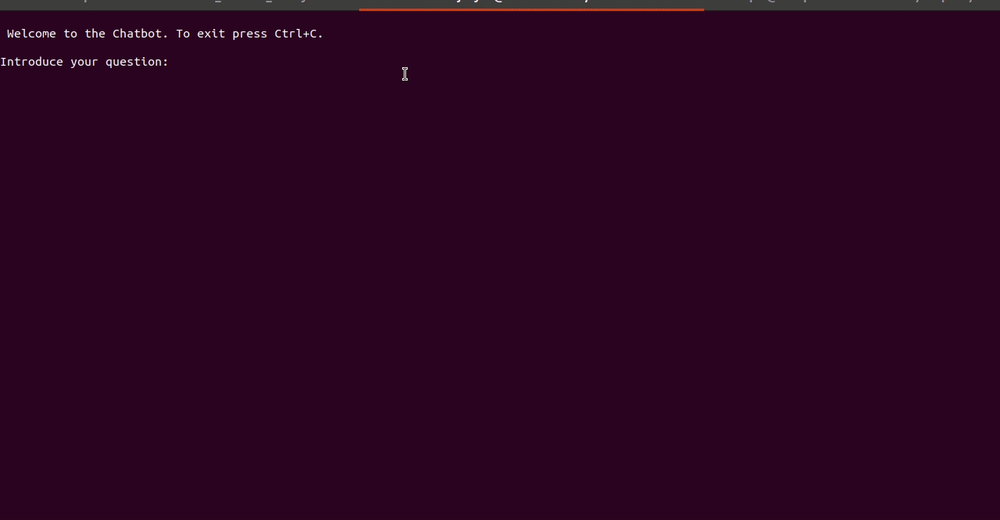

# Let Me Answer For You
> A Simple and Powerful Deep Learning Dialog System for Question and Answering 


A chatbot and API that can answer specific and complex questions. Built on top of the  [deeppavlov library](https://deeppavlov.ai/) 

## Pip Install

The library can be found on **PyPI** so you can just run:
```
pip install let_me_answer_for_you
```

## Simple Usage

Once the package is installed you can download the file `chatbot.py` of the repo and run: 

```
python chatbot.py
```

After the installation process is finished,  the following interface appears:



In this example, there was already an answer to the question and a new context was also added. The function `chatbot.py` accepts the *context* and *faq* files as their flags. If no flags for the files are provided, the system reads them (if inexistent, makes them) from the *data* directory at same path-level of `chatbot.py`

## Technologies

The Chatbot is based on two types of question/answer models:  

  1.   [Question Answering Model for SQuAD dataset](http://docs.deeppavlov.ai/en/master/features/models/squad.html)  
  2.   [Knowledge Base Question Answering](http://docs.deeppavlov.ai/en/master/features/models/kbqa.html)

The first type of models can answer several questions from the same context, while the second type is very useful for specific and complex questions.
It is strongly recommended to consult the [deeppavlov library](https://deeppavlov.ai/)  for further details of the available models for dialog systems.

## Structure of the  Package

The `chatbot.py` module calls the `ChatBot` class in `let_me_answer_for_you.chatbot`. The `ChatBot` is the child of the `DialogSystem` class. This class lives in `let_me_answer_for_you.chatbot.dialog_system` and is composed of the  three main methods of the library:  

  1. [question_answering](/let_me_answer_for_you/dialog_system#DialogSystem.question_answer)
  2. [new_question_answer](/let_me_answer_for_you/dialog_system#DialogSystem.new_question_answer)
  3. [new_context](/let_me_answer_for_you/dialog_system#DialogSystem.new_context)

The first method retrieves a set of answers for a given question. The second method adds a new question-answer pair to the dataset and the third method adds a new context to the dataset. _These are the methods that may be exported as the API calls._

## Documentation 

## Requirements

The library has been tested in `python 3.7`

Install the configuration files by instantiating the `SystemClass` 

```
from let_me_answer_for_you.dialog_system import DialogSystem()

ds = DialogSystem( context_data_file=None,
        faq_data_file=None,
        configs_faq=None,
        download_models=True)
```

If the **context_data_file** or the **faq_data_file** parameters are  `None` , a *data* directory will be created in the directory where the script is running. The data directory will contain the FAQ or the context CSV files

## Get Response

To get a response to a question call the method `question_answer` in the instance of  `SystemClass`


```
ds.question_answer()

Introduce question:
what can you offer me at Intekglobal?


what can you offer me at Intekglobal?:

1: expert resources to connect your different devices and exchange data within those devices
2: Connect with us for further information
3: We like to provide world class solutions with complete features what you want to impletement in your business!
```

## New Question-Answer Pair

Populate the FAQ data file with a new question answer by calling the method `new_q_a`:

```
ds.new_q_a()

Introduce question:
What type of Dialog System is this?

Introduce the answer:
Is a combination of context question answering system with a faq system
```

## New Context

The systems accept a response as a context. The advantage of having contexts is that many answers can be found in one context. To create a new context, call the `new_context` method:

```
ds.new_context()

Give context a title:
 IOT
Introduce the context:
We can provide expert resources to connect your different devices and exchange data within those devices. Further make the data accessible via web tools. Connect with us for further information.   DevOps Our team can help you organization to implement best DevOps practices that can automate the processes between software development and various IT teams, in order that they can build, test, and release software faster and more reliably.
```

## Docker

A container with all the configurations installed can be pulled it with the following instruction:

```
docker pull ejimenezr/dialog_system
```
