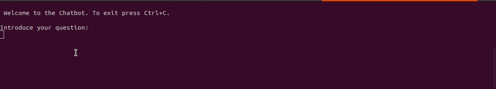
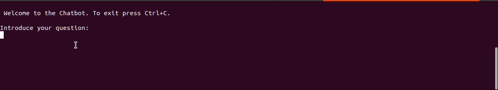

# Let Me Answer For You
> A deep learning dialog system that answers specific and complex questions. 


 Built on top of the  [deeppavlov library](https://deeppavlov.ai/) 

## Pip Install

The library can be found on **PyPI** so you can just run:
```
pip install let_me_answer_for_you
```

## Simple Usage

Download the file `chatbot.py` of the [GitHub](https://github.com/kikejimenez/let_me_answer_for_you) repository and run: 

```
python chatbot.py
```

After the installation process is finished,  the following interface appears:





## Technologies

The Chatbot is based on two types of question/answer models:  

  1.   [Question Answering Model for SQuAD dataset](http://docs.deeppavlov.ai/en/master/features/models/squad.html)  
  2.   [Knowledge Base Question Answering](http://docs.deeppavlov.ai/en/master/features/models/kbqa.html)

The first type of models can answer several questions from the same context, while the second type is very useful for specific and complex questions.
It is strongly recommended to consult the [deeppavlov library](https://deeppavlov.ai/)  for further details of the available models for dialog systems.

## Structure of the  Package

The package `let_me_answer_for_you` consists of three modules: [settings](/let_me_answer_for_you/settings), [dialog_system](/let_me_answer_for_you/dialog_system) and [chatbot](/let_me_answer_for_you/chatbot).

The `chatbot.py` file of the repo, calls the `ChatBot` class in `chatbot` and is the child of the `DialogSystem` class in `dialog_system`. This last class  has the three main methods of the library:  

  1. [question_answering](/let_me_answer_for_you/dialog_system#DialogSystem.question_answer)
  2. [new_question_answer](/let_me_answer_for_you/dialog_system#DialogSystem.new_question_answer)
  3. [new_context](/let_me_answer_for_you/dialog_system#DialogSystem.new_context)

The first method retrieves a set of answers for a given question. The second method adds a new question-answer pair to the FAQ data and retrains the model. The third method adds a new context to the context data. _These are the methods that may be exported as the API calls._

#### [Read the Docs](/let_me_answer_for_you)

#### Requirements

The library has been tested in `python 3.7`

## Docker

A container with all the configurations installed is available:

```
docker pull ejimenezr/dialog_system
```
